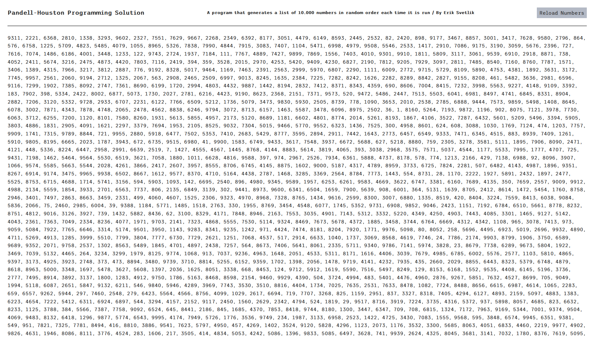

# Pandell-Houston Assessment

# Description

In this assessment, our task was to create an application that generates a list of 10,000 numbers in random order each time it is run. Each number in the list must be unique and be between 1 and 10,000 (inclusive).

The user is able to select the **Reload Numbers** button to generate new numbers.

HTML | CSS | Javascript

# Screenshot

# Link

(https://eriksvetlik.github.io/pandellhouston/)
